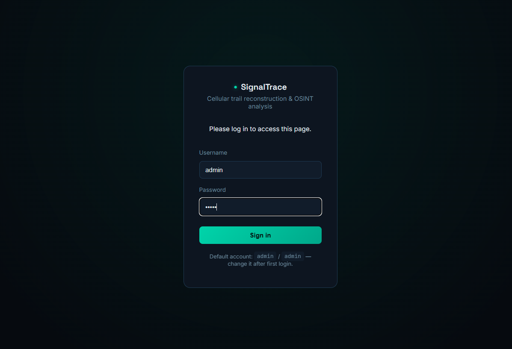
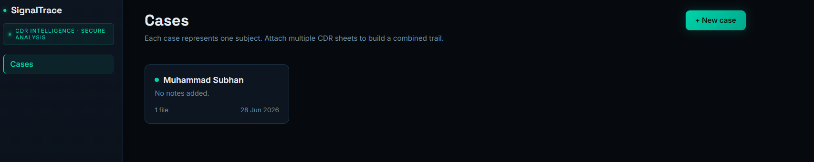
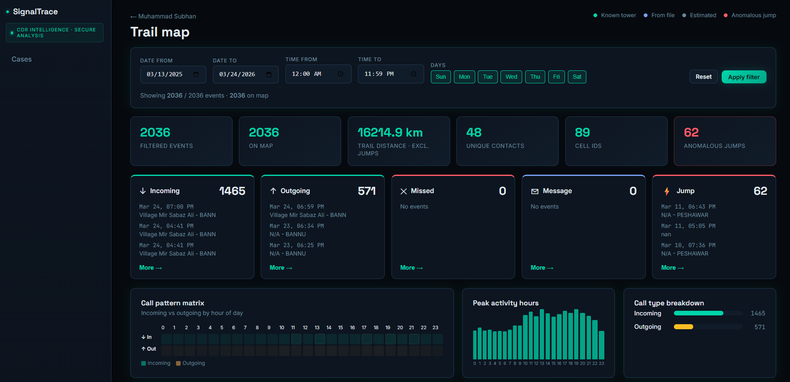
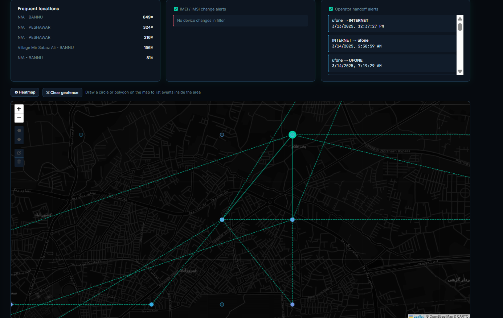
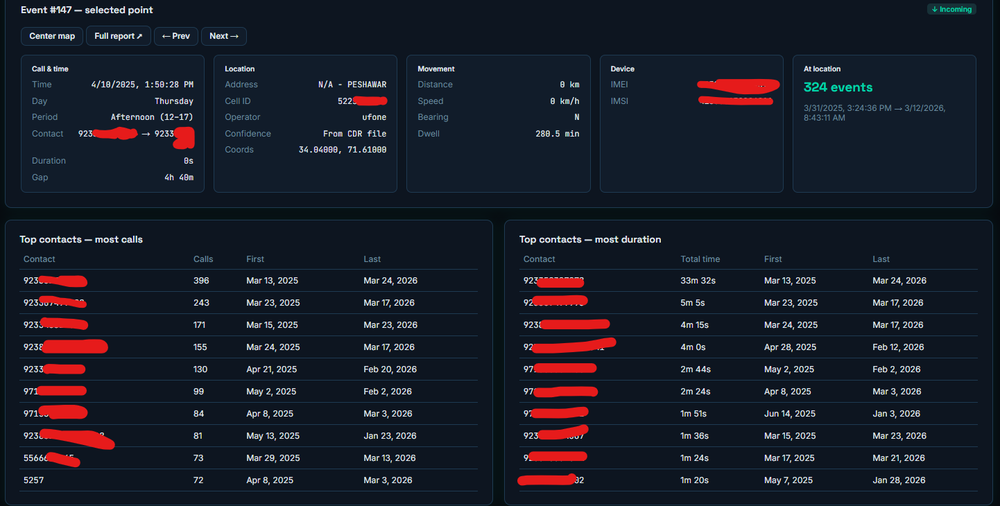
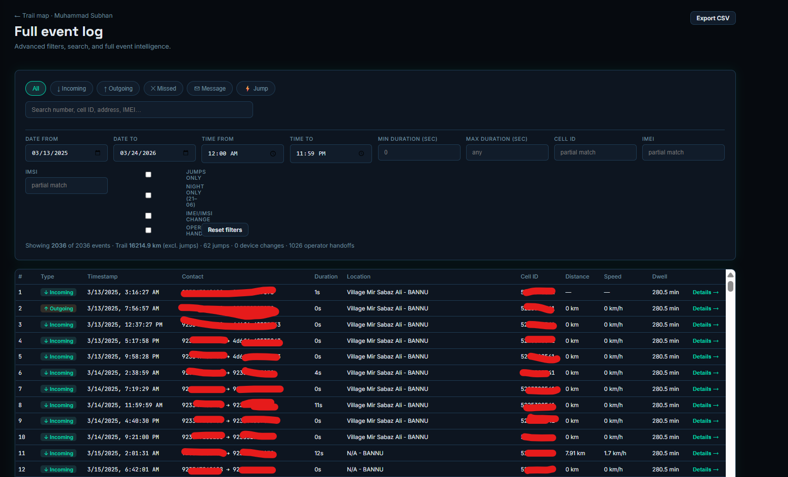
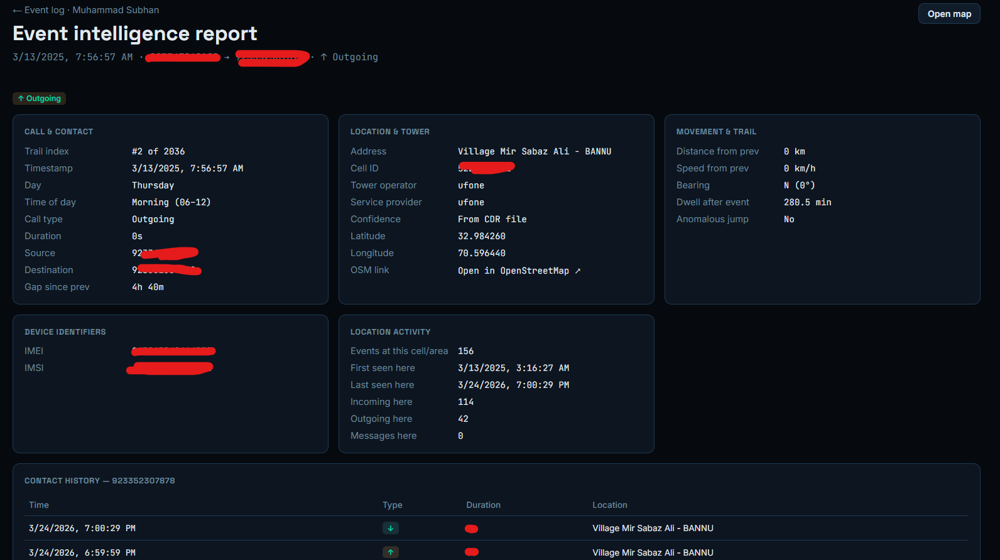

# SignalTrace

**Cellular trail reconstruction & OSINT analysis** — a self-hosted web app for importing Call Detail Record (CDR) sheets, geolocating cell towers, visualizing movement trails on a map, and investigating call patterns over time.

Built with **Flask**, **SQLite**, **Leaflet**, and **pandas**. Designed for digital forensics learning, portfolio demos, and lawful authorized investigations on your own machine.

---

## Screenshots

| Login | Cases dashboard |
|:---:|:---:|
|  |  |

| Trail map — overview & filters | Map — heatmap & geofence |
|:---:|:---:|
|  |  |

| Selected event & top contacts | Full event log & advanced filters |
|:---:|:---:|
|  |  |

| Event intelligence report |
|:---:|
|  |

---

## Features

### Data import & cases
- Single-user login (`admin` / `admin` by default — change after first login)
- Case management — one subject per case, multiple CDR files per case
- CDR import (`.xlsx`, `.xls`, `.csv`) with automatic column detection
- Cell ID → coordinate lookup (tower database + fallback estimation)
- CSV export of normalized records

### Trail map & playback
- Full-width interactive map (dark CARTO tiles) with trail line and color-coded markers
- Tracker-style playback with speed control (0.5×–4×) and smooth map follow
- Date, time, and day-of-week filters applied across the whole dashboard
- Trail distance **excluding anomalous jump segments**
- Heatmap layer toggle
- Geofence — draw circle or polygon; list events inside the area

### Event intelligence
- Event category boxes: Incoming, Outgoing, Missed, Message, Jump
- Event log with type badges; open full report in a new tab
- **Call pattern matrix** — incoming vs outgoing by hour
- Peak activity hours chart and call-type breakdown
- Frequent locations, top contacts (calls & duration)

### Alerts & analysis
- **IMEI / IMSI change alerts** (toggle on/off)
- **Operator handoff alerts** (toggle on/off)
- Anomalous jump detection (configurable speed threshold)
- Speed, bearing, dwell time, and distance between consecutive points

### Event log page
- Filter chips: All, Incoming, Outgoing, Missed, Message, Jump
- Advanced filters: date/time range, duration min/max, Cell ID, IMEI, IMSI
- Night-only, jumps-only, device-change, and operator-handoff filters
- Search across numbers, addresses, and identifiers

### Event detail report
- Per-event intelligence page: call, location, movement, device, location activity
- Contact history at location, prev/next trail context, mini map

---

## Quick start

### Windows (one click)
```bat
start.bat
```

### Mac / Linux
```bash
chmod +x start.sh
./start.sh
```

### Manual
```bash
python -m venv venv
# Windows:  venv\Scripts\activate
# Mac/Linux: source venv/bin/activate
pip install -r requirements.txt
python app.py
```

Open **http://127.0.0.1:5050** and sign in with `admin` / `admin`.

### Demo data
After login, create a case and upload a CDR file. Generate synthetic demo sheets with:
```bash
python sample_data/generate_mock_cdr.py
```

Tower reference data lives in `data/mock_towers_pakistan.csv` (synthetic coordinates near Pakistani city centers — **not** real carrier tower locations).

---

## Project structure

```
cdr-osint-tool/
├── app.py                      Flask routes, auth, upload, API
├── config.py                   App configuration
├── launcher.py                 PyInstaller entry point
├── requirements.txt            Python dependencies
├── database/models.py          User, Case, CDRFile, CDRRecord
├── utils/
│   ├── cdr_parser.py           Column auto-detection & normalization
│   ├── tower_lookup.py         Cell ID → lat/lng
│   └── geo_utils.py            Trail math, alerts, pattern matrix
├── data/mock_towers_pakistan.csv
├── sample_data/                Mock CDR generator
├── templates/                  Jinja2 HTML
├── static/                     CSS & JavaScript
├── docs/screenshots/           README screenshots
├── start.bat / start.sh
└── build_exe.bat               Windows .exe build (optional)
```

---

## Configuration

| Setting | Location | Default |
|---------|----------|---------|
| Anomalous speed threshold | `config.py` → `ANOMALOUS_SPEED_KMH` | 130 km/h |
| Upload size limit | `config.py` → `MAX_CONTENT_LENGTH` | 25 MB |
| Secret key | env `SIGNALTRACE_SECRET_KEY` | Random per run |
| Tower database | `config.py` → `TOWER_DB_PATH` | `data/mock_towers_pakistan.csv` |

---

## Security & privacy (read before publishing or deploying)

### Safe to include on GitHub
- Application source code
- `data/mock_towers_pakistan.csv` (synthetic tower data)
- Default demo login `admin` / `admin` (documented intentionally for local demo)
- Screenshots in `docs/screenshots/` (see caveats below)

### Never commit
- `instance/` — contains SQLite DB and uploaded CDR files (already in `.gitignore`)
- `env/` or `venv/` — local virtual environment
- Real CDR exports, phone numbers, IMEI/IMSI, or investigation case names
- `.env` files with production secrets

### Screenshot privacy notice
Some screenshots in `docs/screenshots/` were captured during development with **real CDR data** and may still show:

- A real person's name (**Muhammad Subhan**) in the cases dashboard and breadcrumbs
- Real phone numbers (partially redacted in some images, **fully visible in others** e.g. contact history)
- Real IMEI / IMSI values (redacted in some images)
- Real village names and GPS coordinates (Bannu, Peshawar, etc.)
- Real ufone operator and cell activity patterns

**Before making this repository public**, either:
1. Re-capture screenshots using **only synthetic demo data** and a fictional case name, or  
2. Blur/redact names, numbers, IMEI/IMSI, and precise locations in the existing images.

The real CDR upload for the Muhammad Subhan case has been **removed from the local project** (`instance/uploads/` and database). Do not re-upload real CDR files into a public repo.

### Legal note
Real CDR data is regulated in most jurisdictions. Use this tool only with data you are **lawfully authorized** to analyze. This project is for education and portfolio demonstration — not a turnkey surveillance product.

---

## Tech stack

| Layer | Technology |
|-------|------------|
| Backend | Flask 3, Flask-Login, Flask-SQLAlchemy |
| Database | SQLite |
| Data | pandas, openpyxl |
| Frontend | Jinja2, vanilla JavaScript |
| Map | Leaflet, leaflet.heat, Leaflet.draw, CARTO dark tiles |

---

## License

This project is provided for educational and portfolio purposes only. All rights are reserved unless otherwise stated

---

## Author

Muhammad Subhan — CDR OSINT analysis tool for digital forensics & OSINT portfolio work.
